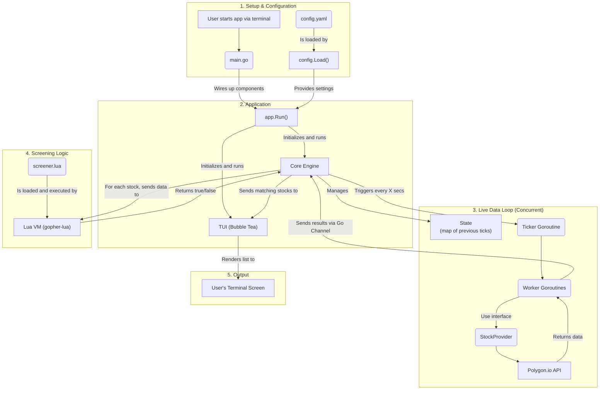

# Stocktopus


A console-based application that continuously scans for stocks meeting a predefined set of criteria, refreshing the displayed list at a configurable interval.

## Core Features

-   **Live Console UI:** Displays a continuously updating list of stocks directly in the terminal.
-   **Configurable Refresh Rate:** The data refresh interval can be easily configured.
-   **Provider-Agnostic Architecture:** Built with a clean, interface-based architecture that allows for multiple market data providers to be easily integrated or swapped out.
-   **Criteria-Based Filtering:** Stocks are filtered based on a hardcoded set of parameters within the application logic.

## Project Architecture

The application is designed around a core `MarketDataProvider` interface. This interface defines a contract for any data source, ensuring that the main screening logic remains completely decoupled from any specific data provider (e.g., Alpha Vantage, Polygon.io, a mock provider).

This abstraction allows for:
1.  Easy extension with new data providers without changing the core application.
2.  Simple testing using a mock provider that returns predictable data.

## Getting Started

### Prerequisites
- Go 1.22 or later

### Installation & Usage
1. Clone the repository:
   ```sh
   git clone [https://github.com/stocktopus-dev/stocktopus.git](https://github.com/stocktopus-dev/stocktopus.git)
   cd stocktopus
   ```


