# Stocktopus
A console-based application that continuously scans for stocks meeting user-defined criteria, displaying a live, real-time list directly in your terminal.

## Core Features
- Live Terminal UI: A clean, responsive interface built with Bubble Tea that updates in real-time without flicker.
- Dynamic Screening with Lua: Define your own complex, stateful screening logic using simple Lua scripts. Test new strategies without ever needing to recompile the application.
- Concurrent & Efficient: Fetches data for multiple stocks concurrently using Go's lightweight goroutines to minimize latency and ensure a responsive experience.
- Provider-Agnostic Architecture: Built with a clean, interface-based architecture that allows for multiple market data providers to be easily integrated or swapped out.

# Project Architecture
The application is designed as a set of decoupled components, orchestrated by a central engine. This separation of concerns makes the system highly testable and extensible. The architecture is visualized in the diagram below.

## Core Engine (internal/engine)

The Engine is the heart of the application. It maintains the state of each tracked stock (e.g., the previous tick's data) and runs the main loop, coordinating data fetching, screening, and UI updates at a configurable interval.

## Provider Model (internal/provider)
To decouple the application from any single data source, we use a StockProvider interface. Any data provider (Polygon.io, Alpha Vantage, or a mock for testing) can be used as long as it satisfies this interface. This makes testing trivial and allows for future expansion.

## Lua Scripting VM (internal/vm)
This is the "brain" of the screener. Instead of hardcoding filter logic, the Engine passes stock data to an embedded Lua virtual machine. The VM executes a user-provided screener.lua script, which returns a simple true or false to determine if a stock should be displayed. This provides ultimate flexibility.

## Terminal UI (internal/tui)
The user interface is a responsive, real-time dashboard built using the excellent Bubble Tea framework. It receives a list of matching stocks from the Engine and renders them to the terminal, handling all display logic, layouts, and color-coding.

# Architecture Diagram

```mermaid
graph TD
    subgraph "1 Setup & Configuration"
        A["User starts app via terminal"] --> B("`main.go`");
        C("config.yaml") -- "Is loaded by" --> D["`config.Load()`"];
    end
    subgraph "2 Application"
        B -- "Wires up components" --> E["`app.Run()`"];
        D -- "Provides settings" --> E;
        E -- "Initializes and runs" --> F["TUI (Bubble Tea)"];
        E -- "Initializes and runs" --> G["Core Engine"];
    end
    subgraph "3 Live Data Loop (Concurrent)"
        G -- "Manages" --> H["`state&#10;(map of previous ticks)`"];
        G -- "Triggers every X secs" --> I("Ticker Goroutine");
        I --> J("Worker Goroutines");
        J -- "Use interface" --> K("StockProvider");
        K --> L["Polygon.io API"];
        L -- "Returns data" --> J;
        J -- "Sends results via Go Channel" --> G;
    end
    subgraph "4 Screening Logic"
        G -- "For each stock, sends data to" --> M["Lua VM (gopher-lua)"];
        N("screener.lua") -- "Is loaded and executed by" --> M;
        M -- "Returns true/false" --> G;
    end
    subgraph "5 Output"
        G -- "Sends matching stocks to" --> F;
        F -- "Renders list to" --> O["User's Terminal Screen"];
    end
```

# Getting Started

## Prerequisites
- Go 1.22 or later (https://go.dev/dl/)
- A Polygon.io API key (https://polygon.io/)

## Installation & Usage

1. **Clone the repository:**
   ```bash
   git clone https://github.com/binarypath/stocktopus.git
   cd stocktopus
   ```

2. **Configure your environment:**
   - Copy `config.yaml` and update the following fields:
     - `apiKey`: Your Polygon.io API key
     - `refreshSeconds`: (Optional) How often to refresh data (default: 15)
     - `tickers`: List of stock tickers to track

3. **Run the application:**
   ```bash
   go run ./cmd/stocktopus
   ```
   Or build and run:
   ```bash
   go build -o stocktopus ./cmd/stocktopus
   ./stocktopus
   ```

4. **Customize screening logic:**
   - Edit the `scripts/screener.lua` file to define your own stock screening rules using Lua.

## Configuration
- All configuration is handled via `config.yaml` in the project root.
- No environment variables are required by default.
- Example `config.yaml`:
  ```yaml
  apiKey: "YOUR_POLYGON_API_KEY_HERE"
  refreshSeconds: 15
  tickers:
    - "AAPL"
    - "GOOGL"
    - "TSLA"
    - "MSFT"
    - "NVDA"
  ```

## Docker Support
*Docker support is not currently implemented. If you would like to contribute a Dockerfile or containerization instructions, please open a pull request!*

# Developer Guide

## Running Tests
To run all tests:
```bash
go test ./...
```

## Contributing
- Fork the repository and create a feature branch.
- Add or update tests for your changes.
- Open a pull request with a clear description of your changes.

# Lua Scripting Example
See `scripts/screener.lua` for an example of how to write your own screening logic in Lua.

# Troubleshooting
- Ensure your `config.yaml` is present and contains a valid Polygon API key.
- If you encounter issues, please open an issue on GitHub with details and logs.
