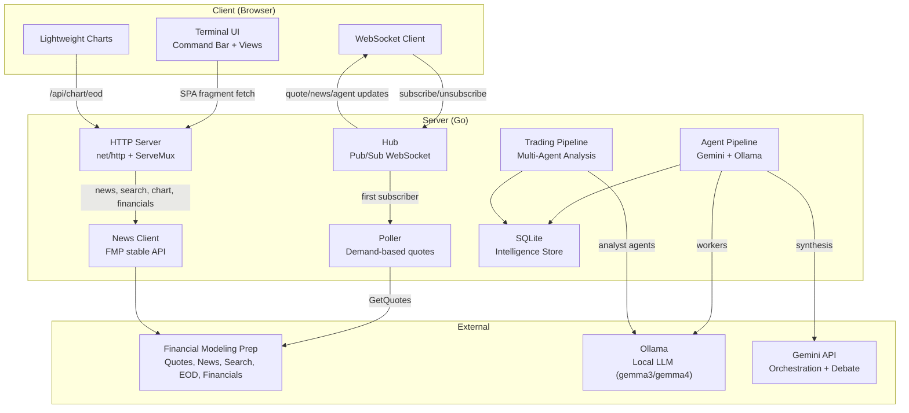

# Stocktopus

A Bloomberg terminal-inspired stock monitoring web app with real-time quotes, news feeds, candlestick charts, AI-powered analysis, and vim-style keyboard navigation.

## Features

- **Command Bar**: Type commands like `graph AAPL`, `news MSFT`, `watchlist`, `analyze AAPL` to navigate. Autocomplete for both commands and securities.
- **Real-Time Watchlist**: Multiple named watchlists with colored badges, live WebSocket quote updates, and flash animations on price changes.
- **Candlestick Charts**: Professional OHLCV charts powered by TradingView Lightweight Charts with range selectors (1m to 6M) and technical indicators (SMA, EMA, MACD, RSI). News event markers overlay on chart.
- **News Feed**: Six categories (Press Releases, Articles, Stock, Crypto, Forex, General) with security filtering, infinite scroll, and AI-powered article reader with entity extraction.
- **Security Info**: Deep-dive company pages with Overview, Financials, Estimates, News, AI Analysis, and Sector tabs. Peer comparison with sparklines and 6M performance charts.
- **Equity Indices**: Global market overview with 9 major indices, sparklines, local exchange times, and open/closed status.
- **AI Company Intelligence**: Gemini-orchestrated analysis pipeline with Ollama workers gathering data from web search, RSS, SEC filings, and social sentiment. Competitor analysis cascading.
- **Multi-Agent Trading Analysis**: TradingAgents-inspired pipeline with 4 parallel Ollama analyst agents (Technical, Fundamentals, News, Sentiment). Button-triggered with cost estimates. Research and risk debate phases planned.
- **Vim Keybindings**: Modal navigation (Normal/Insert) with `hjkl` movement, number keys for tab switching, `:` commands for chart ranges and indicators. Vimium-compatible.
- **Multi-Timezone Clocks**: ET, UTC, UK, and JST times in the footer.

## Architecture


```mermaid
graph TD
    subgraph "Client (Browser)"
        UI["Terminal UI<br/>Command Bar + Views"]
        WS["WebSocket Client"]
        LC["Lightweight Charts"]
    end

    subgraph "Server (Go)"
        SRV["HTTP Server<br/>net/http + ServeMux"]
        HUB["Hub<br/>Pub/Sub WebSocket"]
        POLL["Poller<br/>Demand-based quotes"]
        NEWS["News Client<br/>FMP stable API"]
        AGENT["Agent Pipeline<br/>Gemini + Ollama"]
        TRADE["Trading Pipeline<br/>Multi-Agent Analysis"]
        DB["SQLite<br/>Intelligence Store"]
    end

    subgraph "External"
        FMP["Financial Modeling Prep<br/>Quotes, News, Search, EOD, Financials"]
        OLLAMA["Ollama<br/>Local LLM (gemma3/gemma4)"]
        GEMINI["Gemini API<br/>Orchestration + Debate"]
    end

    UI -- "SPA fragment fetch" --> SRV
    WS -- "subscribe/unsubscribe" --> HUB
    HUB -- "quote/news/agent updates" --> WS
    HUB -- "first subscriber" --> POLL
    POLL -- "GetQuotes" --> FMP
    SRV -- "news, search, chart, financials" --> NEWS
    NEWS --> FMP
    LC -- "/api/chart/eod" --> SRV
    AGENT -- "synthesis" --> GEMINI
    AGENT -- "workers" --> OLLAMA
    TRADE -- "analyst agents" --> OLLAMA
    AGENT --> DB
    TRADE --> DB
```

## Project Structure

```
cmd/stocktopus/              # Entry point
internal/
  agent/                     # AI agent pipeline (Gemini orchestrator + Ollama workers)
    trading/                 # Multi-agent trading analysis (4 analysts, debate, trader)
  hub/                       # WebSocket pub-sub hub with composite routing
  news/                      # FMP client (quotes, news, search, financials, EOD)
  newspoller/                # Demand-based news polling
  poller/                    # Demand-based quote poller
  sectorpoller/              # Sector intelligence polling
  provider/                  # StockProvider interface + FMP/Polygon/AlphaVantage
  server/                    # HTTP server, routes, templates, static assets
  store/                     # SQLite store (intelligence, watchlists, training data)
  model/                     # Data models (Quote, NewsItem, OHLCV)
agents/                      # Python agent scripts (web search, RSS, SEC, sentiment)
tests/
  e2e/                       # E2E smoke tests (build tag: e2e)
  contract/                  # Provider contract tests
worklog/                     # Development notes
```

## Getting Started

### Prerequisites
- Go 1.23+
- [FMP API key](https://financialmodelingprep.com/) (set as `STOCK_API_KEY`)
- [Ollama](https://ollama.ai/) with `gemma3` and `gemma4` models (for AI features)
- Optional: `GEMINI_API_KEY` for AI orchestration and debate synthesis

### Run
```bash
git clone https://github.com/binarypath/stocktopus.git
cd stocktopus
export STOCK_API_KEY=your_fmp_key
make dev
```

Open `http://localhost:8080` in your browser.

### AI Setup
```bash
make setup-agents    # Install Ollama models + Python venv
export GEMINI_API_KEY=your_gemini_key
```

### Commands
```
make build    # Build to bin/stocktopus (includes JS lint)
make dev      # Build and run
make test     # Unit tests
make smoke    # E2E smoke tests (requires STOCK_API_KEY)
make clean    # Remove bin/ and database
```

## Keyboard Reference

| Key | Mode | Action |
|-----|------|--------|
| `Esc` | Insert | Return to Normal mode |
| `Esc` | Normal | Focus command bar (Insert) |
| `/` | Normal | Focus command bar |
| `s` | Normal | Focus security selector |
| `:` | Normal | Command mode (`:1w`, `:3m`, `:sma`, `:rsi`, `:watch`, `:az`) |
| `h/j/k/l` | Normal | Navigate (view-dependent) |
| `Enter` | Normal | Activate selection |
| `g` | Normal | Go to graph for selected security |
| `i` | Normal | Go to info for selected security |
| `?` | Normal | Toggle help tooltips |
| `1-6` | Normal | Jump to tab by number |

## Terminal Commands

| Command | Description |
|---------|-------------|
| `watchlist` | Real-time price table |
| `graph <SEC>` | Candlestick chart |
| `info <SEC>` | Company deep dive |
| `news [SEC]` | Market news feed |
| `ei` | Equity indices |
| `analyze <SEC>` / `az <SEC>` | Run multi-agent trading analysis |
| `screener` | Stock screener |
| `debug` | Live server log console |

## Data Provider

Uses [Financial Modeling Prep](https://financialmodelingprep.com/) stable API for:
- Real-time quotes, historical EOD, intraday charts
- News across 6 categories with date filtering
- Security search by ticker and company name
- Company financials (income, balance sheet, cash flow)
- Key metrics, ratios, analyst estimates
- Sector peers, index lists, SIC codes

## Credits

- Charts powered by [TradingView Lightweight Charts](https://www.tradingview.com/lightweight-charts/) (Apache 2.0)
- AI analysis powered by [Ollama](https://ollama.ai/) (local) and [Gemini](https://ai.google.dev/) (cloud)
