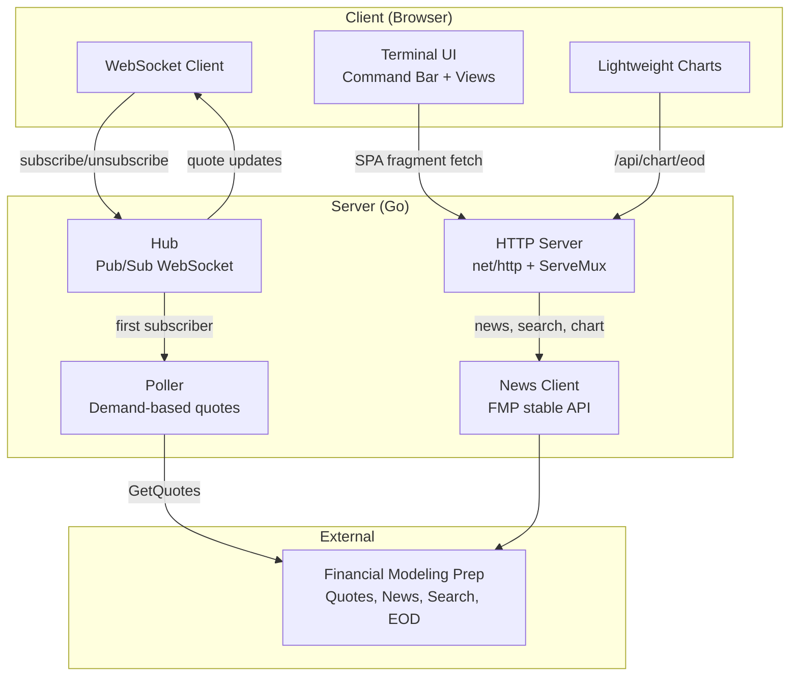

# Stocktopus

A Bloomberg terminal-inspired stock monitoring web app with real-time quotes, news feeds, candlestick charts, and vim-style keyboard navigation.

## Features

- **Command Bar**: Type commands like `graph AAPL`, `news MSFT`, `watchlist` to navigate. Autocomplete for both commands and securities (searches by ticker and company name).
- **Real-Time Watchlist**: Subscribe to securities and get live quote updates via WebSocket with flash animations on price changes.
- **Candlestick Charts**: Professional OHLCV charts powered by TradingView Lightweight Charts with 1W/1M/3M/6M range selectors and volume overlay.
- **News Feed**: Six categories (Press Releases, Articles, Stock, Crypto, Forex, General) with security filtering, tabbed interface, and infinite scroll.
- **Security Search**: FMP-powered search by ticker and company name, available in both the command bar and security selector.
- **Vim Keybindings**: Modal navigation (Normal/Insert) with `hjkl` movement, number keys for tab switching, `:` commands for chart ranges. Vimium-compatible.
- **Multi-Timezone Clocks**: ET, UTC, UK, and JST times in the footer for market awareness.

## Architecture


```mermaid
graph TD
    subgraph "Client (Browser)"
        UI["Terminal UI<br/>Command Bar + Views"]
        WS["WebSocket Client"]
        LC["Lightweight Charts"]
    end

    subgraph "Server (Go)"
        SRV["HTTP Server<br/>net/http + ServeMux"]
        HUB["Hub<br/>Pub/Sub WebSocket"]
        POLL["Poller<br/>Demand-based quotes"]
        NEWS["News Client<br/>FMP stable API"]
    end

    subgraph "External"
        FMP["Financial Modeling Prep<br/>Quotes, News, Search, EOD"]
    end

    UI -- "SPA fragment fetch" --> SRV
    WS -- "subscribe/unsubscribe" --> HUB
    HUB -- "quote updates" --> WS
    HUB -- "first subscriber" --> POLL
    POLL -- "GetQuotes" --> FMP
    SRV -- "news, search, chart" --> NEWS
    NEWS --> FMP
    LC -- "/api/chart/eod" --> SRV
```

## Project Structure

```
cmd/stocktopus/          # Entry point
internal/
  hub/                   # WebSocket pub-sub hub
  news/                  # FMP news, search, and chart data client
  poller/                # Demand-based quote poller
  provider/              # StockProvider interface + implementations (FMP, Polygon, AlphaVantage)
  server/                # HTTP server, routes, templates, static assets
  model/                 # Data models (Quote, NewsItem, OHLCV)
tests/
  e2e/                   # E2E smoke tests (build tag: e2e)
  contract/              # Provider contract tests
worklog/                 # Development notes
```

## Getting Started

### Prerequisites
- Go 1.23+
- [FMP API key](https://financialmodelingprep.com/) (set as `STOCK_API_KEY` env var)

### Run
```bash
git clone https://github.com/binarypath/stocktopus.git
cd stocktopus
export STOCK_API_KEY=your_api_key
make dev
```

Open `http://localhost:8080` in your browser.

### Commands
```
make build    # Build to bin/stocktopus
make dev      # Build and run
make test     # Unit tests
make smoke    # E2E smoke tests (requires STOCK_API_KEY)
make clean    # Remove bin/
```

## Keyboard Reference

| Key | Mode | Action |
|-----|------|--------|
| `Esc` | Insert | Return to Normal mode |
| `Esc` | Normal | Focus command bar (Insert) |
| `/` | Normal | Focus command bar |
| `s` | Normal | Focus security selector |
| `:` | Normal | Chart command mode (`:1w`, `:1m`, `:3m`, `:6m`) |
| `h/j/k/l` | Normal | Navigate (view-dependent) |
| `Enter` | Normal | Activate selection |
| `g` | Normal | Go to graph for selected security (watchlist) |
| `1-6` | Normal | Jump to news tab by number |

## Data Provider

Uses [Financial Modeling Prep](https://financialmodelingprep.com/) stable API for:
- Real-time quotes (`/stable/quote`, `/stable/batch-quote`)
- Historical EOD data (`/stable/historical-price-eod/full`)
- News across 6 categories (`/stable/news/*`)
- Security search by ticker and name (`/stable/search-symbol`, `/stable/search-name`)
